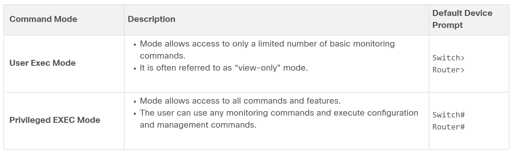
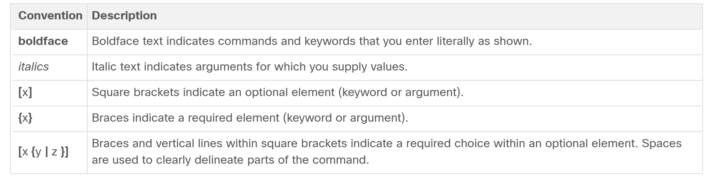

Certainly! Here's an organized breakdown of the key protocols across various layers of the networking model:

### Network Access Layer
1. **ARP (Address Resolution Protocol)**
   - **Purpose:** Find MAC addresses of devices on the same network using IP addresses.
   - **Operation:** Uses a broadcast signal (ARP request) on the LAN with the target IP address. The device with that IP replies with an ARP reply containing its MAC address. This information is cached in the sender's ARP table for future use.

2. **Ethernet**
   - **Purpose:** Defines how packets are sent and received on LANs.
   - **Operation:** Uses CSMA/CD (Carrier Sense Multiple Access with Collision Detection) to manage data transmission, checking if the medium is free before sending data to avoid collisions.

3. **WLAN (Wireless Local Area Network)**
   - **Purpose:** Connects wireless devices like smartphones, tablets, and laptops to a local network.

### Internet Layer
1. **IPv4**
   - **Purpose:** Provides addressing and routing for packets across networks.
   - **Operation:** Uses routing tables to direct packets to their destination.

2. **NAT (Network Address Translation)**
   - **Purpose:** Allows multiple devices on a local network to share a single public IP address.
   - **Operation:** Translates private IP addresses to a public IP address for outgoing traffic and vice versa for incoming traffic.

3. **IPv6**
   - **Purpose:** Provides a larger address space than IPv4.
   - **Features:** Supports automatic address configuration (SLAAC), manual configuration (RA), multicast, and anycast addressing.

4. **DHCP (Dynamic Host Configuration Protocol)**
   - **Purpose:** Automatically assigns IP addresses to devices on a network.
   - **Operation:** Devices send a DHCP request to obtain an IP address and other network configurations.

5. **ICMPv4 (Internet Control Message Protocol for IPv4)**
   - **Purpose:** Used for diagnostics and error reporting.
   - **Features:** Includes echo requests and replies (ping) and traceroute functionality.

6. **ICMPv6**
   - **Purpose:** Similar to ICMPv4 but for IPv6 networks.
   - **Features:** Includes additional functionalities like MLD (Multicast Listener Discovery) and ND (Neighbor Discovery).

### Transport Layer
1. **TCP (Transmission Control Protocol)**
   - **Purpose:** Provides reliable, connection-oriented communication.
   - **Features:** Uses acknowledgments, sequence numbers, flow control, error detection, and supports full duplex communication.

2. **UDP (User Datagram Protocol)**
   - **Purpose:** Provides fast, connectionless communication.
   - **Features:** Low overhead, supports broadcast and multicast, and is commonly used for multimedia and online gaming.

3. **3-Way Handshake (TCP Connection Establishment)**
   - **Steps:** Client sends SYN, server responds with SYN-ACK, client sends ACK.

### Application Layer
1. **DNS (Domain Name System)**
   - **Purpose:** Translates domain names to IP addresses.
   - **Features:** Uses root servers and caching to store resolved DNS records temporarily.

2. **DHCPv4 and DHCPv6**
   - **Purpose:** Automatically assigns IP addresses and network configurations to devices.
   - **DHCPv6 Features:** Introduces prefix delegation and works with SLAAC.

3. **HTTP (Hypertext Transfer Protocol)**
   - **Purpose:** Used for transmitting web pages.
   - **Features:** Stateless, supports content negotiation and caching.

4. **HTTPS (HTTP Secure)**
   - **Purpose:** Secure version of HTTP.
   - **Features:** Encrypts data using SSL/TLS for confidentiality and integrity.

5. **Email Protocols (SMTP, POP3, IMAP)**
   - **SMTP:** Sends emails, supports authentication, and secure transmission.
   - **POP3:** Retrieves emails, downloads and stores them locally.
   - **IMAP:** Manages and syncs emails across multiple devices, supports advanced folder management.

6. **FTP (File Transfer Protocol)**
   - **Purpose:** Transfers files between client and server.
   - **Features:** Uses clear-text, can be secured with FTPS.

7. **SFTP (SSH File Transfer Protocol)**
   - **Purpose:** Secure file transfer.
   - **Features:** Uses SSH for encryption, supports SSH key-based authentication.

8. **TFTP (Trivial File Transfer Protocol)**
   - **Purpose:** Simple file transfer protocol, often used in LANs.
   - **Features:** Connectionless, uses UDP, minimal security, suitable for simple requests.

### Summary
These protocols enable efficient communication and data transfer across different layers of a network, from physical connections to application-level interactions, ensuring that devices can connect, communicate, and exchange data reliably and securely.

Sure, here's a condensed cheat sheet based on the provided information:

---

### Cisco IOS Command Modes and Prompts



**User Exec Mode**
- Limited capabilities, view-only mode.
- Identified by the CLI prompt ending with `>`.
- Default Device Prompt: `Switch>` or `Router>`

**Privileged Exec Mode**
- Access to all commands and features.
- Identified by the prompt ending with `#`.
- Default Device Prompt: `Switch#` or `Router#`

**Global Configuration Mode**
- Configure device-wide settings.
- Prompt: `<DeviceName>(config)#`

### Moving Between Modes

- User Exec to Privileged Exec: `enable`
- Privileged Exec to User Exec: `disable`
- Global Config Mode: `configure terminal`
- Return to Privileged Exec Mode: `exit`

### Subconfiguration Modes

- **Line Configuration Mode**: `line <line-type> <line-number>`
- **Interface Configuration Mode**: `interface <interface-name>`

### Naming Guidelines for Hosts

- Start with a letter
- Contain no spaces
- End with a letter or digit
- Use only letters, digits, and dashes
- Less than 64 characters

### Setting Hostname

```
Switch# configure terminal
Switch(config)# hostname <NewHostName>
```

### Banner Message of the Day

```
Switch# configure terminal
Switch(config)# banner motd #<Message>#
```
### Navigating between IOS Modes

- to enter line subconfiguration mode, you use the line command followed by the management line type and number you wish to access. Use the exit command to exit a subconfiguration mode and return to global configuration mode.
.png)

- To move from any subconfiguration mode of the global configuration mode to the mode one step above it in the hierarchy of modes, enter the exit command.

- To move from any subconfiguration mode to the privileged EXEC mode, enter the end command or enter the key combination Ctrl+Z.
.png)

- You can also move directly from one subconfiguration mode to another. Notice how after selecting an interface, the command prompt changes from (config-line)# to (config-if)#.

.png)

### IOS Command Syntax Check


### Configure Password
.png)

- Console access will now require a password before allowing access to the user EXEC mode.

- To have administrator access to all IOS commands including configuring a device, you must gain privileged EXEC mode access. It is the most important access method because it provides complete access to the device.

- To secure privileged EXEC access, use the enable secret password global config command, as shown in the example.

.png)

- Virtual terminal (VTY) lines enable remote access using Telnet or SSH to the device. Many Cisco switches support up to 16 VTY lines that are numbered 0 to 15.

- To secure VTY lines, enter line VTY mode using the line vty 0 15 global config command. Next, specify the VTY password using the password password command. Lastly, enable VTY access using the login command.

- An example of securing the VTY lines on a switch is shown.
.png)

### Encrypt Passwords

- The startup-config and running-config files display most passwords in plaintext. This is a security threat because anyone can discover the passwords if they have access to these files.

- To encrypt all plaintext passwords, use the service password-encryption global config command as shown in the example

.png)

- The command applies weak encryption to all unencrypted passwords. This encryption applies only to passwords in the configuration file, not to passwords as they are sent over the network. The purpose of this command is to keep unauthorized individuals from viewing passwords in the configuration file.

- Use the show running-config command to verify that passwords are now encrypted.

.png)

### System Files

```
System Files for Device Configuration:

1. startup-config:
   - Location: NVRAM
   - Purpose: Saved configuration for device startup or reboot
   - Persistence: Non-volatile; retains contents after power off
   - Contents: All commands for device operation upon startup
   
2. running-config:
   - Location: RAM
   - Purpose: Current configuration for device operation
   - Persistence: Volatile; loses contents after power off or restart
   - Contents: Reflects real-time configuration changes; immediate impact on device operation
```
### Manual IP Configuration

```
Manual IP Address Configuration for Windows:

1. Open Control Panel > Network and Sharing Center.
2. Click on "Change adapter settings."
3. Right-click on the desired network adapter and select "Properties."
4. In the adapter properties window, select "Internet Protocol Version 4 (TCP/IPv4)" and click "Properties."
5. In the IPv4 properties window:
   - Select "Use the following IP address" if not already selected.
   - Enter the desired IPv4 address in the "IP address" field.
   - Enter the subnet mask in the "Subnet mask" field.
   - Optionally, enter the default gateway in the "Default gateway" field.
   - You can also specify DNS servers if needed.
6. Click "OK" to apply the changes and close the windows.
7. Optionally, you may need to restart the network adapter or the computer for changes to take effect.

Note: Similar steps can be followed for configuring IPv6 addresses.
```
### Automatic IP Configuration 

```
Automatic IP Address Configuration (DHCP) for Windows:

1. Open Control Panel > Network and Sharing Center.
2. Click on "Change adapter settings."
3. Right-click on the desired network adapter and select "Properties."
4. In the adapter properties window, select "Internet Protocol Version 4 (TCP/IPv4)" and click "Properties."
5. In the IPv4 properties window:
   - Select "Obtain an IP address automatically."
   - Select "Obtain DNS server address automatically."
6. Click "OK" to apply the changes and close the windows.
7. Your PC will automatically search for a DHCP server and be assigned the necessary IP address settings to communicate on the network.

Note: DHCP configuration allows for automatic assignment of IPv4 addresses, subnet masks, default gateways, and DNS server addresses, reducing manual configuration effort and minimizing the chance of misconfiguration.
```

### Configuring Switch Virtual Interface (SVI) on Cisco switches

.png)

### Basic Router Configuration
```
1.Configure the device name.

Router(config)# hostname hostname

2. Secure privileged EXEC mode.

Router(config)# enable secret password

3. Secure user EXEC mode.

Router(config)# line console 0
Router(config-line)# password password
Router(config-line)# login

4. Secure remote Telnet / SSH access.

Router(config-line)# line vty 0 4
Router(config-line)# password password
Router(config-line)# login
Router(config-line)# transport input {ssh | telnet}

5. Secure all passwords in the config file.

Router(config-line)# exit
Router(config)# service password-encryption

6. Provide legal notification.

Router(config)# banner motd delimiter message delimiter

7. Save the configuration.

Router(config)# end
Router# copy running-config startup-config