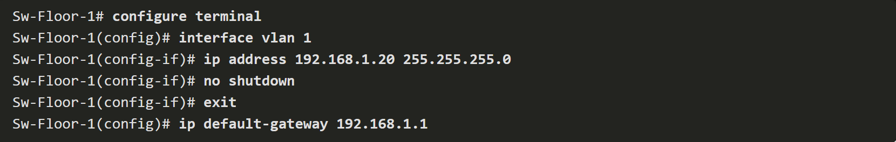

### Summary
These protocols enable efficient communication and data transfer across different layers of a network, from physical connections to application-level interactions, ensuring that devices can connect, communicate, and exchange data reliably and securely.


## VLSM

Variable Length Subnet Masking (VLSM) is a technique used in IP addressing and subnetting to allocate IP addresses efficiently by allowing different subnets to have subnet masks of varying lengths. This enables more precise allocation of IP addresses based on the needs of each subnet.

Here's a step-by-step explanation of VLSM:

1. **Identify Subnets and Host Requirements**: Begin by listing all the subnets that need to be created, along with their respective host requirements. The host requirement for each subnet is the number of end devices in that subnet plus the default gateway for that subnet.

2. **Order Subnets by Host Requirements**: Arrange the subnets in descending order of their host requirements, starting from the subnet with the highest host requirement to the one with the lowest.

3. **Allocate Prefix Lengths**: For each subnet, find the largest valid prefix length (subnet mask) that can accommodate the host requirement. This involves determining the number of bits required to satisfy the host requirement. The formula to calculate this is \(2^h \geq \text{host requirement}\), where \(h\) is the number of bits remaining in the host portion of the IP address.

4. **Calculate IP Chunk Size**: Once the prefix length is determined for each subnet, calculate the size of the IP chunk for each subnet. This is calculated as \(2^h\), where \(h\) is the number of bits remaining in the host portion after subnetting.

5. **Assign Subnet Addresses**: Start with the subnet address of the largest subnet (with the highest host requirement) and allocate IP addresses accordingly. Then, for each subsequent subnet, calculate the subnet address by adding the size of the IP chunk of the current subnet to the subnet address of the previous subnet.

6. **Configure Subnet Masks**: Assign the appropriate subnet masks to each subnet based on the prefix lengths determined in step 3.

By following these steps, VLSM allows for efficient utilization of IP addresses by allocating them based on the specific requirements of each subnet, thereby reducing IP address wastage and optimizing address space usage.

### Examples 

**Step 1: Identify Subnets and Host Requirements**
Consider a network that needs to be subnetted into four subnets with the following host requirements:
- Subnet A: 60 hosts
- Subnet B: 30 hosts
- Subnet C: 12 hosts
- Subnet D: 6 hosts

**Step 2: Order Subnets by Host Requirements**
Arrange the subnets in descending order of their host requirements:
1. Subnet A (60 hosts)
2. Subnet B (30 hosts)
3. Subnet C (12 hosts)
4. Subnet D (6 hosts)

**Step 3: Allocate Prefix Lengths**
For each subnet, find the largest valid prefix length that can accommodate the host requirement.

- Subnet A (60 hosts):
  - \(2^6 = 64 \geq 60\), so we need at least 6 bits for hosts.
  - The subnet mask for Subnet A will be /26.
- Subnet B (30 hosts):
  - \(2^5 = 32 \geq 30\), so we need at least 5 bits for hosts.
  - The subnet mask for Subnet B will be /27.
- Subnet C (12 hosts):
  - \(2^4 = 16 \geq 12\), so we need at least 4 bits for hosts.
  - The subnet mask for Subnet C will be /28.
- Subnet D (6 hosts):
  - \(2^3 = 8 \geq 6\), so we need at least 3 bits for hosts.
  - The subnet mask for Subnet D will be /29.

**Step 4: Calculate IP Chunk Size**
Calculate the size of the IP chunk for each subnet.

- Subnet A (/26): \(2^6 = 64\)
- Subnet B (/27): \(2^5 = 32\)
- Subnet C (/28): \(2^4 = 16\)
- Subnet D (/29): \(2^3 = 8\)

**Step 5: Assign Subnet Addresses**
Start with a base IP address and allocate addresses for each subnet, ensuring that each subnet falls within its allocated address range.

Let's assume the base IP address is 192.168.1.0:

- Subnet A (/26): 192.168.1.0 (64 hosts)
- Subnet B (/27): 192.168.1.64 (32 hosts)
- Subnet C (/28): 192.168.1.96 (16 hosts)
- Subnet D (/29): 192.168.1.112 (8 hosts)

**Step 6: Configure Subnet Masks**
Assign the appropriate subnet masks to each subnet based on the prefix lengths determined earlier.

- Subnet A (/26): 255.255.255.192
- Subnet B (/27): 255.255.255.224
- Subnet C (/28): 255.255.255.240
- Subnet D (/29): 255.255.255.248

## VLSM vs FLSM

Sure, let's illustrate both FLSM and VLSM with a simple example:

**Example Scenario:**
Suppose we have a network with the IP address range 192.168.1.0/24 and we need to create four subnets with the following host requirements:
1. Subnet A: 60 hosts
2. Subnet B: 30 hosts
3. Subnet C: 12 hosts
4. Subnet D: 6 hosts

**Fixed Length Subnet Masking (FLSM) Example:**

For FLSM, we'll divide the network into four equal-sized subnets, each with a subnet mask of /26 (which provides 64 hosts per subnet).

- Subnet A: 192.168.1.0/26 (addresses 192.168.1.1 to 192.168.1.62, with 192.168.1.0 reserved as the network address and 192.168.1.63 reserved as the broadcast address)
- Subnet B: 192.168.1.64/26 (addresses 192.168.1.65 to 192.168.1.126)
- Subnet C: 192.168.1.128/26 (addresses 192.168.1.129 to 192.168.1.190)
- Subnet D: 192.168.1.192/26 (addresses 192.168.1.193 to 192.168.1.254)

With FLSM, each subnet gets the same number of IP addresses (64), regardless of its actual host requirement. This may lead to inefficient utilization of IP addresses.

**Variable Length Subnet Masking (VLSM) Example:**

For VLSM, we'll allocate subnet masks based on the specific host requirements of each subnet, starting with the subnet requiring the largest number of hosts.

1. Subnet A: Requires 60 hosts. We can use a /26 subnet mask (providing 64 hosts).
2. Subnet B: Requires 30 hosts. We can use a /27 subnet mask (providing 32 hosts).
3. Subnet C: Requires 12 hosts. We can use a /28 subnet mask (providing 16 hosts).
4. Subnet D: Requires 6 hosts. We can use a /29 subnet mask (providing 8 hosts).

- Subnet A: 192.168.1.0/26 (addresses 192.168.1.1 to 192.168.1.62)
- Subnet B: 192.168.1.64/27 (addresses 192.168.1.65 to 192.168.1.94)
- Subnet C: 192.168.1.96/28 (addresses 192.168.1.97 to 192.168.1.110)
- Subnet D: 192.168.1.112/29 (addresses 192.168.1.113 to 192.168.1.118)

With VLSM, each subnet gets a subnet mask tailored to its specific host requirement, resulting in more efficient utilization of IP addresses compared to FLSM.

# Copper Media

Shielding:
Purpose: Shields in cables protect against electromagnetic and radio frequency interference (EMI/RFI) that can disrupt signals.
Types:
- Foil Shielding: Consists of a thin layer of metallic foil.
- Braided Shielding: Comprises a woven mesh of metallic strands.
Applications: Commonly used in environments with high interference, such as industries and data centers.

Twisted Pair Cables:
Structure: Made up of pairs of twisted copper wires to reduce interference.
Types:
- STP (Shielded Twisted Pair): Includes external shielding for added protection.
- UTP (Unshielded Twisted Pair): Relies solely on twisting for interference reduction.
Usage: Widely utilized in Ethernet networks and telecommunications systems.

Coaxial Cables:
Shielding: Equipped with built-in shielding comprising layers for signal protection.
Applications: Frequently employed in cable TV connections, broadband internet, and high-frequency data transmission scenarios.

Fiber Optic Cables:
Immunity: Immune to EMI/RFI interference due to their light-based signal transmission.
Advantages: Offer high bandwidth, minimal signal loss over long distances, and secure data transmission capabilities.



<sub><sup>Left is physical, Right is Logical</sup></sub>


---

Certainly! Here's an organized breakdown of the key protocols across various layers of the networking model:

### Network Access Layer
1. **ARP (Address Resolution Protocol)**
   - **Purpose:** Find MAC addresses of devices on the same network using IP addresses.
   - **Operation:** Uses a broadcast signal (ARP request) on the LAN with the target IP address. The device with that IP replies with an ARP reply containing its MAC address. This information is cached in the sender's ARP table for future use.

2. **Ethernet**
   - **Purpose:** Defines how packets are sent and received on LANs.
   - **Operation:** Uses CSMA/CD (Carrier Sense Multiple Access with Collision Detection) to manage data transmission, checking if the medium is free before sending data to avoid collisions.

3. **WLAN (Wireless Local Area Network)**
   - **Purpose:** Connects wireless devices like smartphones, tablets, and laptops to a local network.

### Internet Layer
1. **IPv4**
   - **Purpose:** Provides addressing and routing for packets across networks.
   - **Operation:** Uses routing tables to direct packets to their destination.

2. **NAT (Network Address Translation)**
   - **Purpose:** Allows multiple devices on a local network to share a single public IP address.
   - **Operation:** Translates private IP addresses to a public IP address for outgoing traffic and vice versa for incoming traffic.

3. **IPv6**
   - **Purpose:** Provides a larger address space than IPv4.
   - **Features:** Supports automatic address configuration (SLAAC), manual configuration (RA), multicast, and anycast addressing.

4. **DHCP (Dynamic Host Configuration Protocol)**
   - **Purpose:** Automatically assigns IP addresses to devices on a network.
   - **Operation:** Devices send a DHCP request to obtain an IP address and other network configurations.

5. **ICMPv4 (Internet Control Message Protocol for IPv4)**
   - **Purpose:** Used for diagnostics and error reporting.
   - **Features:** Includes echo requests and replies (ping) and traceroute functionality.

6. **ICMPv6**
   - **Purpose:** Similar to ICMPv4 but for IPv6 networks.
   - **Features:** Includes additional functionalities like MLD (Multicast Listener Discovery) and ND (Neighbor Discovery).

### Transport Layer
1. **TCP (Transmission Control Protocol)**
   - **Purpose:** Provides reliable, connection-oriented communication.
   - **Features:** Uses acknowledgments, sequence numbers, flow control, error detection, and supports full duplex communication.

2. **UDP (User Datagram Protocol)**
   - **Purpose:** Provides fast, connectionless communication.
   - **Features:** Low overhead, supports broadcast and multicast, and is commonly used for multimedia and online gaming.

3. **3-Way Handshake (TCP Connection Establishment)**
   - **Steps:** Client sends SYN, server responds with SYN-ACK, client sends ACK.

### Application Layer
1. **DNS (Domain Name System)**
   - **Purpose:** Translates domain names to IP addresses.
   - **Features:** Uses root servers and caching to store resolved DNS records temporarily.

2. **DHCPv4 and DHCPv6**
   - **Purpose:** Automatically assigns IP addresses and network configurations to devices.
   - **DHCPv6 Features:** Introduces prefix delegation and works with SLAAC.

3. **HTTP (Hypertext Transfer Protocol)**
   - **Purpose:** Used for transmitting web pages.
   - **Features:** Stateless, supports content negotiation and caching.

4. **HTTPS (HTTP Secure)**
   - **Purpose:** Secure version of HTTP.
   - **Features:** Encrypts data using SSL/TLS for confidentiality and integrity.

5. **Email Protocols (SMTP, POP3, IMAP)**
   - **SMTP:** Sends emails, supports authentication, and secure transmission.
   - **POP3:** Retrieves emails, downloads and stores them locally.
   - **IMAP:** Manages and syncs emails across multiple devices, supports advanced folder management.

6. **FTP (File Transfer Protocol)**
   - **Purpose:** Transfers files between client and server.
   - **Features:** Uses clear-text, can be secured with FTPS.

7. **SFTP (SSH File Transfer Protocol)**
   - **Purpose:** Secure file transfer.
   - **Features:** Uses SSH for encryption, supports SSH key-based authentication.

8. **TFTP (Trivial File Transfer Protocol)**
   - **Purpose:** Simple file transfer protocol, often used in LANs.
   - **Features:** Connectionless, uses UDP, minimal security, suitable for simple requests.

### Summary
These protocols enable efficient communication and data transfer across different layers of a network, from physical connections to application-level interactions, ensuring that devices can connect, communicate, and exchange data reliably and securely.

Sure, here's a condensed cheat sheet based on the provided information:

---

### Cisco IOS Command Modes and Prompts


**User Exec Mode**
- Limited capabilities, view-only mode.
- Identified by the CLI prompt ending with `>`.
- Default Device Prompt: `Switch>` or `Router>`

**Privileged Exec Mode**
- Access to all commands and features.
- Identified by the prompt ending with `#`.
- Default Device Prompt: `Switch#` or `Router#`

**Global Configuration Mode**
- Configure device-wide settings.
- Prompt: `<DeviceName>(config)#`

### Moving Between Modes

- User Exec to Privileged Exec: `enable`
- Privileged Exec to User Exec: `disable`
- Global Config Mode: `configure terminal`
- Return to Privileged Exec Mode: `exit`

### Subconfiguration Modes

- **Line Configuration Mode**: `line <line-type> <line-number>`
- **Interface Configuration Mode**: `interface <interface-name>`

### Naming Guidelines for Hosts

- Start with a letter
- Contain no spaces
- End with a letter or digit
- Use only letters, digits, and dashes
- Less than 64 characters

### Setting Hostname

```
Switch# configure terminal
Switch(config)# hostname <NewHostName>
```

### Banner Message of the Day

```
Switch# configure terminal
Switch(config)# banner motd #<Message>#
```
### Navigating between IOS Modes

- to enter line subconfiguration mode, you use the line command followed by the management line type and number you wish to access. Use the exit command to exit a subconfiguration mode and return to global configuration mode.
.png)

- To move from any subconfiguration mode of the global configuration mode to the mode one step above it in the hierarchy of modes, enter the exit command.

- To move from any subconfiguration mode to the privileged EXEC mode, enter the end command or enter the key combination Ctrl+Z.
.png)

- You can also move directly from one subconfiguration mode to another. Notice how after selecting an interface, the command prompt changes from (config-line)# to (config-if)#.

.png)

### IOS Command Syntax Check


### Configure Password
.png)

- Console access will now require a password before allowing access to the user EXEC mode.

- To have administrator access to all IOS commands including configuring a device, you must gain privileged EXEC mode access. It is the most important access method because it provides complete access to the device.

- To secure privileged EXEC access, use the enable secret password global config command, as shown in the example.

.png)

- Virtual terminal (VTY) lines enable remote access using Telnet or SSH to the device. Many Cisco switches support up to 16 VTY lines that are numbered 0 to 15.

- To secure VTY lines, enter line VTY mode using the line vty 0 15 global config command. Next, specify the VTY password using the password password command. Lastly, enable VTY access using the login command.

- An example of securing the VTY lines on a switch is shown.
.png)

### Encrypt Passwords

- The startup-config and running-config files display most passwords in plaintext. This is a security threat because anyone can discover the passwords if they have access to these files.

- To encrypt all plaintext passwords, use the service password-encryption global config command as shown in the example

.png)

- The command applies weak encryption to all unencrypted passwords. This encryption applies only to passwords in the configuration file, not to passwords as they are sent over the network. The purpose of this command is to keep unauthorized individuals from viewing passwords in the configuration file.

- Use the show running-config command to verify that passwords are now encrypted.

.png)

### System Files

```
System Files for Device Configuration:

1. startup-config:
   - Location: NVRAM
   - Purpose: Saved configuration for device startup or reboot
   - Persistence: Non-volatile; retains contents after power off
   - Contents: All commands for device operation upon startup
   
2. running-config:
   - Location: RAM
   - Purpose: Current configuration for device operation
   - Persistence: Volatile; loses contents after power off or restart
   - Contents: Reflects real-time configuration changes; immediate impact on device operation
```
### Manual IP Configuration

```
Manual IP Address Configuration for Windows:

1. Open Control Panel > Network and Sharing Center.
2. Click on "Change adapter settings."
3. Right-click on the desired network adapter and select "Properties."
4. In the adapter properties window, select "Internet Protocol Version 4 (TCP/IPv4)" and click "Properties."
5. In the IPv4 properties window:
   - Select "Use the following IP address" if not already selected.
   - Enter the desired IPv4 address in the "IP address" field.
   - Enter the subnet mask in the "Subnet mask" field.
   - Optionally, enter the default gateway in the "Default gateway" field.
   - You can also specify DNS servers if needed.
6. Click "OK" to apply the changes and close the windows.
7. Optionally, you may need to restart the network adapter or the computer for changes to take effect.

Note: Similar steps can be followed for configuring IPv6 addresses.
```
### Automatic IP Configuration 

```
Automatic IP Address Configuration (DHCP) for Windows:

1. Open Control Panel > Network and Sharing Center.
2. Click on "Change adapter settings."
3. Right-click on the desired network adapter and select "Properties."
4. In the adapter properties window, select "Internet Protocol Version 4 (TCP/IPv4)" and click "Properties."
5. In the IPv4 properties window:
   - Select "Obtain an IP address automatically."
   - Select "Obtain DNS server address automatically."
6. Click "OK" to apply the changes and close the windows.
7. Your PC will automatically search for a DHCP server and be assigned the necessary IP address settings to communicate on the network.

Note: DHCP configuration allows for automatic assignment of IPv4 addresses, subnet masks, default gateways, and DNS server addresses, reducing manual configuration effort and minimizing the chance of misconfiguration.
```

### Configuring Switch Virtual Interface (SVI) on Cisco switches

.png)

### Basic Router Configuration
```
1.Configure the device name.

Router(config)# hostname hostname

2. Secure privileged EXEC mode.

Router(config)# enable secret password

3. Secure user EXEC mode.

Router(config)# line console 0
Router(config-line)# password password
Router(config-line)# login

4. Secure remote Telnet / SSH access.

Router(config-line)# line vty 0 4
Router(config-line)# password password
Router(config-line)# login
Router(config-line)# transport input {ssh | telnet}

5. Secure all passwords in the config file.

Router(config-line)# exit
Router(config)# service password-encryption

6. Provide legal notification.

Router(config)# banner motd delimiter message delimiter

7. Save the configuration.

Router(config)# end
Router# copy running-config startup-config

# Application Protocols

### Network Access Layer
1. **ARP (Address Resolution Protocol)**
   - **Purpose:** Find MAC addresses of devices on the same network using IP addresses.
   - **Operation:** Uses a broadcast signal (ARP request) on the LAN with the target IP address. The device with that IP replies with an ARP reply containing its MAC address. This information is cached in the sender's ARP table for future use.

2. **Ethernet**
   - **Purpose:** Defines how packets are sent and received on LANs.
   - **Operation:** Uses CSMA/CD (Carrier Sense Multiple Access with Collision Detection) to manage data transmission, checking if the medium is free before sending data to avoid collisions.

3. **WLAN (Wireless Local Area Network)**
   - **Purpose:** Connects wireless devices like smartphones, tablets, and laptops to a local network.

### Internet Layer
1. **IPv4**
   - **Purpose:** Provides addressing and routing for packets across networks.
   - **Operation:** Uses routing tables to direct packets to their destination.

2. **NAT (Network Address Translation)**
   - **Purpose:** Allows multiple devices on a local network to share a single public IP address.
   - **Operation:** Translates private IP addresses to a public IP address for outgoing traffic and vice versa for incoming traffic.

3. **IPv6**
   - **Purpose:** Provides a larger address space than IPv4.
   - **Features:** Supports automatic address configuration (SLAAC), manual configuration (RA), multicast, and anycast addressing.

4. **DHCP (Dynamic Host Configuration Protocol)**
   - **Purpose:** Automatically assigns IP addresses to devices on a network.
   - **Operation:** Devices send a DHCP request to obtain an IP address and other network configurations.

5. **ICMPv4 (Internet Control Message Protocol for IPv4)**
   - **Purpose:** Used for diagnostics and error reporting.
   - **Features:** Includes echo requests and replies (ping) and traceroute functionality.

6. **ICMPv6**
   - **Purpose:** Similar to ICMPv4 but for IPv6 networks.
   - **Features:** Includes additional functionalities like MLD (Multicast Listener Discovery) and ND (Neighbor Discovery).

### Transport Layer
1. **TCP (Transmission Control Protocol)**
   - **Purpose:** Provides reliable, connection-oriented communication.
   - **Features:** Uses acknowledgments, sequence numbers, flow control, error detection, and supports full duplex communication.

2. **UDP (User Datagram Protocol)**
   - **Purpose:** Provides fast, connectionless communication.
   - **Features:** Low overhead, supports broadcast and multicast, and is commonly used for multimedia and online gaming.

3. **3-Way Handshake (TCP Connection Establishment)**
   - **Steps:** Client sends SYN, server responds with SYN-ACK, client sends ACK.

### Application Layer
1. **DNS (Domain Name System)**
   - **Purpose:** Translates domain names to IP addresses.
   - **Features:** Uses root servers and caching to store resolved DNS records temporarily.

2. **DHCPv4 and DHCPv6**
   - **Purpose:** Automatically assigns IP addresses and network configurations to devices.
   - **DHCPv6 Features:** Introduces prefix delegation and works with SLAAC.

3. **HTTP (Hypertext Transfer Protocol)**
   - **Purpose:** Used for transmitting web pages.
   - **Features:** Stateless, supports content negotiation and caching.

4. **HTTPS (HTTP Secure)**
   - **Purpose:** Secure version of HTTP.
   - **Features:** Encrypts data using SSL/TLS for confidentiality and integrity.

5. **Email Protocols (SMTP, POP3, IMAP)**
   - **SMTP:** Sends emails, supports authentication, and secure transmission.
   - **POP3:** Retrieves emails, downloads and stores them locally.
   - **IMAP:** Manages and syncs emails across multiple devices, supports advanced folder management.

6. **FTP (File Transfer Protocol)**
   - **Purpose:** Transfers files between client and server.
   - **Features:** Uses clear-text, can be secured with FTPS.

7. **SFTP (SSH File Transfer Protocol)**
   - **Purpose:** Secure file transfer.
   - **Features:** Uses SSH for encryption, supports SSH key-based authentication.

8. **TFTP (Trivial File Transfer Protocol)**
   - **Purpose:** Simple file transfer protocol, often used in LANs.
   - **Features:** Connectionless, uses UDP, minimal security, suitable for simple requests.

### Summary
These protocols enable efficient communication and data transfer across different layers of a network, from physical connections to application-level interactions, ensuring that devices can connect, communicate, and exchange data reliably and securely.

Sure, here's a condensed cheat sheet based on the provided information:

---

### Cisco IOS Command Modes and Prompts


**User Exec Mode**
- Limited capabilities, view-only mode.
- Identified by the CLI prompt ending with `>`.
- Default Device Prompt: `Switch>` or `Router>`

**Privileged Exec Mode**
- Access to all commands and features.
- Identified by the prompt ending with `#`.
- Default Device Prompt: `Switch#` or `Router#`

**Global Configuration Mode**
- Configure device-wide settings.
- Prompt: `<DeviceName>(config)#`

### Moving Between Modes

- User Exec to Privileged Exec: `enable`
- Privileged Exec to User Exec: `disable`
- Global Config Mode: `configure terminal`
- Return to Privileged Exec Mode: `exit`

### Subconfiguration Modes

- **Line Configuration Mode**: `line <line-type> <line-number>`
- **Interface Configuration Mode**: `interface <interface-name>`

### Naming Guidelines for Hosts

- Start with a letter
- Contain no spaces
- End with a letter or digit
- Use only letters, digits, and dashes
- Less than 64 characters

### Setting Hostname

```
Switch# configure terminal
Switch(config)# hostname <NewHostName>
```

### Banner Message of the Day

```
Switch# configure terminal
Switch(config)# banner motd #<Message>#
```
### Navigating between IOS Modes

- to enter line subconfiguration mode, you use the line command followed by the management line type and number you wish to access. Use the exit command to exit a subconfiguration mode and return to global configuration mode.
.png)

- To move from any subconfiguration mode of the global configuration mode to the mode one step above it in the hierarchy of modes, enter the exit command.

- To move from any subconfiguration mode to the privileged EXEC mode, enter the end command or enter the key combination Ctrl+Z.
.png)

- You can also move directly from one subconfiguration mode to another. Notice how after selecting an interface, the command prompt changes from (config-line)# to (config-if)#.

.png)

### IOS Command Syntax Check


### Configure Password
.png)

- Console access will now require a password before allowing access to the user EXEC mode.

- To have administrator access to all IOS commands including configuring a device, you must gain privileged EXEC mode access. It is the most important access method because it provides complete access to the device.

- To secure privileged EXEC access, use the enable secret password global config command, as shown in the example.

.png)

---
# Subnetting

## Fixed Length Subnet Masking (FLSM)

### Key Concepts and Formulas

1. **Number of Subnets:**
   - Formula: \( 2^b \)
   - \( b \) = number of bits borrowed from the host part to create the subnet part.

2. **Number of Hosts per Subnet:**
   - Formula: \( 2^h - 2 \)
   - \( h \) = number of bits remaining for hosts in the subnet.
   - The subtraction of 2 accounts for the network address and the broadcast address, which cannot be assigned to hosts.

### Steps to Calculate Subnets and Hosts

1. **Identify the total number of bits in the IP address.**
   - For IPv4, it's 32 bits.

2. **Determine the default subnet mask for the given network class:**
   - Class A: Default subnet mask is 255.0.0.0 (/8)
   - Class B: Default subnet mask is 255.255.0.0 (/16)
   - Class C: Default subnet mask is 255.255.255.0 (/24)

3. **Decide on the new subnet mask based on requirements.**
   - For example, if you need to create more subnets, you borrow bits from the host portion.

4. **Calculate the number of subnets:**
   - Determine how many bits you can borrow from the host portion without leaving too few bits for hosts.
   - Use the formula \( 2^b \) where \( b \) is the number of bits borrowed.

5. **Calculate the number of hosts per subnet:**
   - Subtract the number of bits borrowed from the total bits available for hosts.
   - Use the formula \( 2^h - 2 \), where \( h \) is the remaining bits for hosts.

### Example Calculation

#### Given:

- A Class C network: 192.168.1.0/24
- We need 4 subnets.

#### Step-by-Step:

1. **Default subnet mask for Class C: /24 (255.255.255.0)**

2. **Determine the number of bits to borrow:**
   - To create 4 subnets: \( 2^b \geq 4 \)
   - \( b = 2 \) (because \( 2^2 = 4 \))

3. **New subnet mask:**
   - Original mask /24 plus 2 borrowed bits: /26
   - New subnet mask: 255.255.255.192 (/26)

4. **Calculate the number of subnets:**
   - \( 2^b = 2^2 = 4 \)

5. **Calculate the number of hosts per subnet:**
   - Remaining bits for hosts: 32 total bits - 26 subnet bits = 6 bits
   - \( 2^h - 2 = 2^6 - 2 = 64 - 2 = 62 \)
   - Each subnet can have 62 hosts.

#### Summary:

- **Number of subnets:** 4
- **Number of hosts per subnet:** 62

### Ensuring Sufficient Subnets and Hosts without Wastage

1. **Determine the total number of required subnets and hosts per subnet.**
   - Ensure the number of bits borrowed for subnets provides at least the required number of subnets.
   - Ensure the remaining bits for hosts provide at least the required number of hosts.

2. **Balance between the number of subnets and the number of hosts:**
   - If you need more subnets, you will have fewer hosts per subnet (and vice versa).
   - Borrow only the necessary number of bits to meet your subnet requirements, leaving as many bits as possible for hosts to minimize wastage.

By carefully planning the number of bits borrowed and the resulting subnet mask, you can efficiently use FLSM to create the required number of subnets and allocate the necessary number of hosts per subnet without wastage.